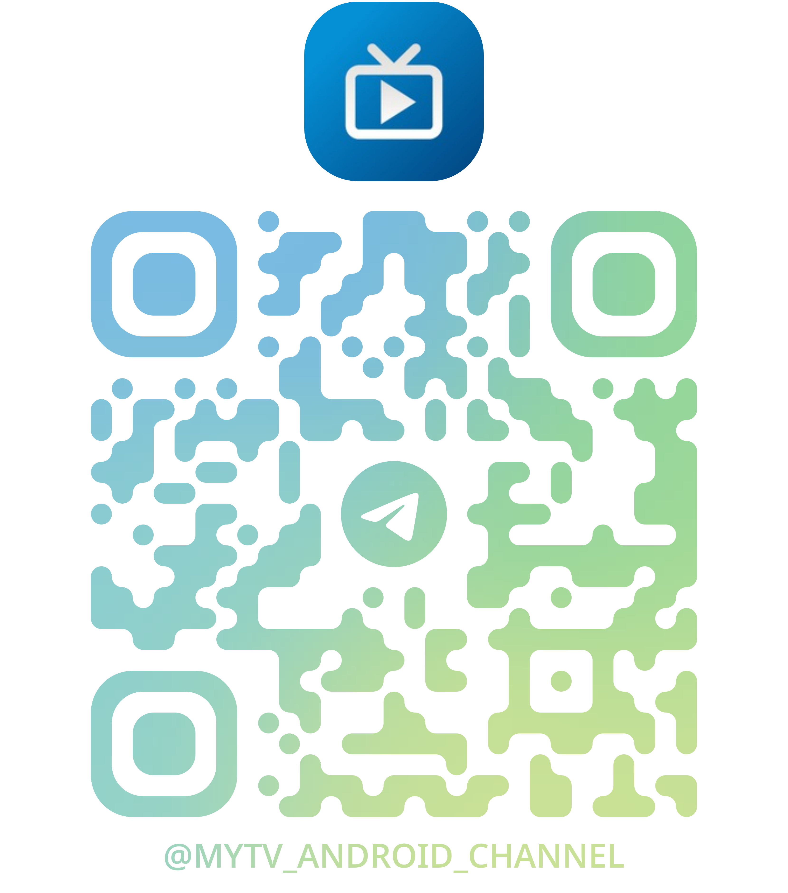

<div align="center">
    <h1>TV Live<sup>TV</sup></h1>
<div align="center">

<p align="right">
  <a href="README.md">🇨🇳 中文</a> | <a href="README_EN.md">🇺🇸 English</a>
</p>


[](https://apilevels.com/#:~:text=Jetpack%20Compose%20requires%20a%20minSdk%20of%2021%20or%20higher)
[](https://github.com/mytv-android/mytv-android)

</div>
<p>Based on Tianguang Yunying 3.3.9 and the last open-source version of mytv-android, mainly modified for Sony remote controls (the ones with many buttons). Package name and version number have also been changed. Should also work with other brands of remote controls.</p>

<!--  -->
<br/>

<!-- 
 -->
</div>

## Key Features

- **Sony TV Deep Integration**
  - **Comprehensive Remote Control Support:**
    - Channel Up/Down keys (CHANNEL_UP/CHANNEL_DOWN)
    - Number key support (KEYCODE_NUMBER)
    - Color function keys support (Red/Green/Yellow/Blue keys)
    - Audio track switch key (KEYCODE_MEDIA_AUDIO_TRACK)
    - Subtitle switch key (KEYCODE_CAPTIONS)
    - Program guide key (KEYCODE_GUIDE)
    - Info display key (KEYCODE_INFO)
    - MENU key QuickOp interface toggle
    - F2 key Dashboard and live page switching
    - Last channel key (KEYCODE_LAST_CHANNEL)
  - **USB Remote Support** - Extended remote control compatibility
  - **Key Logic Optimization** - Designed for Sony remote control usage habits

- **New EPG Interface:**
  - EpgGuideScreen program guide main interface
  - Channel list and program grid display
  - Date selection and time slot display
  - Quick access to current programs

- **Other Features:**
  - Player core switching popup functionality
  - Default configuration adjustments - Disabled channel group switching and auto-update
  - Removed adaptive icon, as Sony TVs use rectangular icons

## Remote Control Usage

### How to Operate

> Original remote control operation methods supported by the code

- **Channel switching**: Use up/down arrow keys, or number keys to switch channels; swipe up/down on screen
- **Channel selection**: OK key; tap screen
- **Line switching**: Use left/right arrow keys; swipe left/right on screen  
- **Settings page**: Press menu or help key, long press OK key; double tap or long press screen

### Supported Remote Control Keys  

Added support for multiple remote control types and key mappings. All keys are intercepted by the app to avoid conflicts with the TV system, but some keys have highest priority and cannot be intercepted, such as the help key.

#### Channel Switching Keys

##### Standard Android TV Remote
| Function | Key Name | KeyCode | Value | Description |
|----------|----------|---------|-------|-------------|
| Channel+ | `KEYCODE_CHANNEL_UP` | 166 | Standard TV remote channel up key |
| Channel- | `KEYCODE_CHANNEL_DOWN` | 167 | Standard TV remote channel down key |

##### USB Remote/External Remote
| Function | Key Name | KeyCode | Value | Description |
|----------|----------|---------|-------|-------------|
| Channel+ | `KEYCODE_MEDIA_PREVIOUS` | 88 | Media previous key |
| Channel- | `KEYCODE_MEDIA_NEXT` | 87 | Media next key |
| Channel+ | `KEYCODE_PAGE_UP` | 92 | Page up key |
| Channel- | `KEYCODE_PAGE_DOWN` | 93 | Page down key |
| Channel+ | `KEYCODE_PLUS` | 81 | Plus key |
| Channel- | `KEYCODE_MINUS` | 69 | Minus key |
| Channel+ | `KEYCODE_NUMPAD_ADD` | 157 | Numpad add key |
| Channel- | `KEYCODE_NUMPAD_SUBTRACT` | 156 | Numpad subtract key |

#### Number Key Support
| Key | KeyCode Name | KeyCode | Value | Function Description |
|-----|--------------|---------|-------|---------------------|
| 0 | `KEYCODE_0` | 7 | Number 0 key, direct channel selection |
| 1 | `KEYCODE_1` | 8 | Number 1 key, direct channel selection |
| 2 | `KEYCODE_2` | 9 | Number 2 key, direct channel selection |
| 3 | `KEYCODE_3` | 10 | Number 3 key, direct channel selection |
| 4 | `KEYCODE_4` | 11 | Number 4 key, direct channel selection |
| 5 | `KEYCODE_5` | 12 | Number 5 key, direct channel selection |
| 6 | `KEYCODE_6` | 13 | Number 6 key, direct channel selection |
| 7 | `KEYCODE_7` | 14 | Number 7 key, direct channel selection |
| 8 | `KEYCODE_8` | 15 | Number 8 key, direct channel selection |
| 9 | `KEYCODE_9` | 16 | Number 9 key, direct channel selection |

> **Important Note**: All number keys (0-9) are completely intercepted by the app and **will not trigger TV system channel switching**, only used for direct channel selection within the app.

#### Function Key Support
| Function | Key Name | KeyCode | Value | Function Description |
|----------|----------|---------|-------|---------------------|
| EPG Toggle | `KEYCODE_LAST_CHANNEL` | 229 | Last channel key, toggle between global EPG page and live page |
| Program Guide | `KEYCODE_GUIDE` | 172 | Current channel program guide |
| Player Info Display | `KEYCODE_INFO` | 165 | Info key, show/hide player detailed information |
| Audio Track Switch | `KEYCODE_MEDIA_AUDIO_TRACK` | 222 | Audio track key, show/hide audio track selection interface |
| Subtitle Switch | `KEYCODE_CAPTIONS` | 175 | Subtitle key, show/hide subtitle selection interface |
| Dashboard Toggle | `KEYCODE_F2` | 132 | F2 key, toggle between Dashboard homepage and live page |

> **Function Descriptions**:
> - **Last Channel Key**: First press enters EPG program guide page, press again returns to live page
> - **Info Key**: First press shows player detailed information, press again hides player information
> - **Audio Track Key**: First press shows audio track selection interface, press again closes audio track interface
> - **Subtitle Key**: First press shows subtitle selection interface, press again closes subtitle interface
> - **F2 Key**: First press enters Dashboard homepage, press again returns to live page

#### Color Key Support
| Function | Key Name | KeyCode | Value | Function Description |
|----------|----------|---------|-------|---------------------|
| Line Switch | `KEYCODE_PROG_RED` | 183 | Red function key, show/hide line selection interface |
| Audio Track Switch | `KEYCODE_PROG_GREEN` | 184 | Green function key, show/hide audio track selection interface |
| Subtitle Switch | `KEYCODE_PROG_YELLOW` | 185 | Yellow function key, show/hide subtitle selection interface |
| Dashboard Homepage | `KEYCODE_PROG_BLUE` | 186 | Blue function key, toggle between Dashboard homepage and live page |

> **Function Descriptions**:
> - **Red Key**: First press shows line selection interface, press again closes line interface
> - **Green Key**: First press shows audio track selection interface, press again closes audio track interface
> - **Yellow Key**: First press shows subtitle selection interface, press again closes subtitle interface
> - **Blue Key**: First press enters Dashboard homepage, press again returns to live page

#### Debug and Extension Support

If your remote control uses key codes not included in the above list, you can get the specific KeyCode through the following method:

1. **Enable ADB debugging**:
   ```bash
   adb connect <TV IP address>
   adb logcat | grep mytv
   ```

2. **Press remote control keys** and check log output:
   ```
   Unknown key intercepted: keyCode=XXX, scanCode=XXX, displayLabel='X'
   ```

#### Key Interception Mechanism

The app uses the `dispatchKeyEvent()` method to intercept key events at the system level:
- **Complete Interception**: Channel switching keys return `true`, preventing events from being passed to the TV system
- **App Priority**: Number keys are processed by the app first, then system processing is prevented
- **Compatibility Guarantee**: Unrecognized keys are logged but do not affect normal functionality

### Touch Key Mapping

- **Direction keys**: Swipe up/down/left/right on screen
- **OK key**: Tap screen
- **Long press OK key**: Long press screen
- **Menu/Help keys**: Double tap screen

### Custom Settings

- Visit the following URL: `http://<device IP>:10591` to access the web configuration page

## Download

You can download releases from the right sidebar or clone the code and build locally.

## Notes

- Only supports Android 5.0 and above
- Only tested on my own TV, stability on other devices is unknown

### Regarding Issues

The following description is from the original project. If there are issues with this project, please create an issue, but I can only handle remote control key-related problems.


## Information (Chinese language only)

For communication (this group is generally not for bug feedback or suggestions, please use issues for those) and beta information release, please follow this channel to get the latest updates and participate in update voting.

<div align="center">
    
</div>

## Star History

<a href="https://www.star-history.com/#mytv-android/mytv-android&Date">
 <picture>
   <source media="(prefers-color-scheme: dark)" srcset="https://api.star-history.com/svg?repos=mytv-android/mytv-android&type=Date&theme=dark" />
   <source media="(prefers-color-scheme: light)" srcset="https://api.star-history.com/svg?repos=mytv-android/mytv-android&type=Date" />
   
 </picture>
</a>

## Copyright, License Statement, and Acknowledgements

- This software is based on Tianguang Yunying ([https://github.com/yaoxieyoulei/mytv-android/tree/feature/ui](https://github.com/yaoxieyoulei/mytv-android/tree/feature/ui)). Special thanks to the author yaoxieyoulei for their selfless contribution. Tianguang Yunying uses the MIT license, see [Tianguang Yunying License](./LICENSE_ORIGIN). If you copy the software code, please retain this license and the original author's copyright statement.
- This software uses the GNU license, see [Project License](./LICENSE). You are free to distribute and derive from this software. However, when distributing or deriving from this code, you cannot change the license; you must open source your modified code; and you must retain the relevant statements of this software.
- This software also uses parts of BV ([https://github.com/aaa1115910/bv](https://github.com/aaa1115910/bv)). Special thanks to aaa1115910. [License](./LICENSE_PART1).