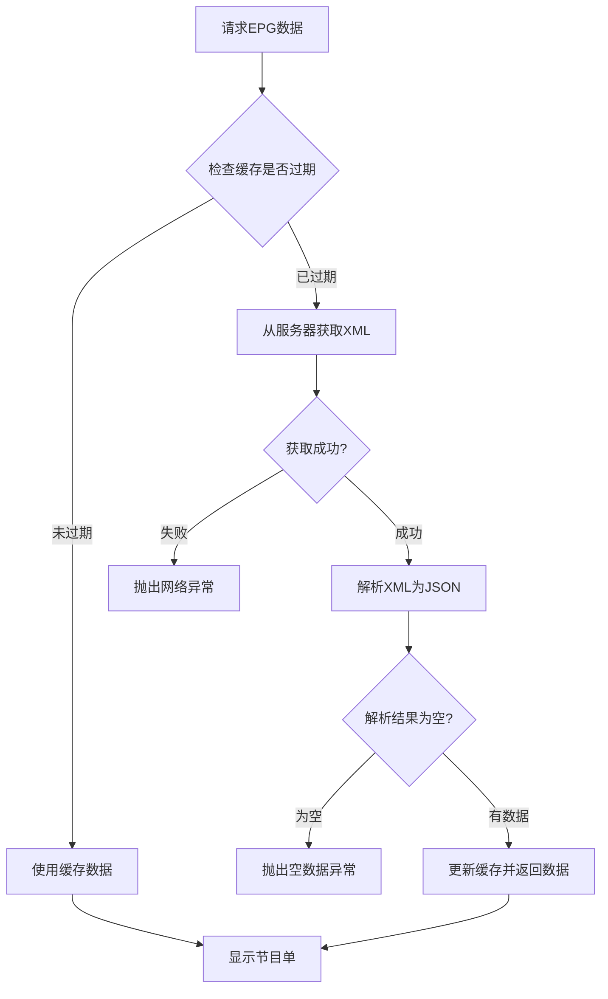

# EPG 节目单匹配与更新机制

本文档详细说明了 MyTV Android 应用中 EPG（电子节目单）的匹配逻辑和更新机制。

## 📋 目录

- [EPG 数据更新机制](#epg-数据更新机制)
- [频道匹配逻辑](#频道匹配逻辑)
- [缓存机制](#缓存机制)
- [常见问题与解决方案](#常见问题与解决方案)
- [代码实现详解](#代码实现详解)

## 🔄 EPG 数据更新机制

### 更新时间策略

EPG 数据采用**按日期更新**的策略：

```kotlin
// EpgRepository.kt:28-31
private fun isExpired(lastModified: Long): Boolean {
    val dateFormat = SimpleDateFormat("yyyy-MM-dd", Locale.getDefault())
    return dateFormat.format(System.currentTimeMillis()) != dateFormat.format(lastModified)
}
```

**更新规则**：
- ✅ **每天自动更新一次**（跨日期时触发）
- ✅ **首次添加EPG源**时立即获取
- ✅ **手动清除缓存**时强制更新
- ❌ 同一天内不会重复请求（除非清除缓存）

### 更新触发时机

1. **应用启动**时检查缓存是否过期
2. **切换频道**时加载节目单
3. **设置EPG源**后首次使用
4. **跨日期**时自动更新
5. **手动清除缓存**后下次访问

### 更新流程



## 🎯 频道匹配逻辑

### M3U 频道解析

从 M3U 文件中提取 EPG 名称：

```kotlin
// M3uIptvParser.kt:26-28
val epgName = Regex("tvg-name=\"(.*?)\"").find(line)?.groupValues?.get(1)?.trim()
    ?.ifBlank { name } ?: name
```

**匹配优先级**：
1. 优先使用 `tvg-name` 属性值
2. 如果 `tvg-name` 为空，使用频道名称 `name`
3. 存储在 `Channel.epgName` 中用于匹配

### EPG 频道解析

从 XMLTV 格式的 EPG 文件中解析频道信息：

```kotlin
// EpgParser.kt:67-75
"display-name" -> {
    val displayName = ChannelAlias.standardChannelName(parser.nextText())
    lastChannel.displayNames.add(displayName)
}
```

**特点**：
- 一个频道可以有多个 `<display-name>` 标签（多个别名）
- 每个 `display-name` 都会进行标准化处理
- 存储在 `epg.channelList` 中用于匹配

### 频道名称标准化

为了提高匹配成功率，系统对频道名称进行标准化处理：

```kotlin
// ChannelAlias.kt:25-45
fun standardChannelName(name: String): String {
    // 移除后缀 + 别名映射 + 缓存
}
```

**处理步骤**：
1. **去除后缀**：移除 "HD"、"超高清"、"卫视" 等常见后缀
2. **别名映射**：统一不同写法（如 "CCTV1" → "CCTV-1"）
3. **LRU 缓存**：避免重复计算，提高性能

### 匹配算法

```kotlin
// EpgList.kt:37-46
return matchCache.getOrPut(channel.epgName) {
    firstOrNull { epg ->
        epg.channelList.any { it.equals(channel.epgName, ignoreCase = true) }
    } ?: Epg()
}
```

**匹配规则**：
- 使用频道的 `epgName` 与 EPG 中所有频道的 `channelList` 进行匹配
- **忽略大小写**进行字符串比较
- 使用 64 大小的 LRU 缓存避免重复计算
- 返回第一个匹配的 EPG 数据

### 匹配示例

```
M3U 示例:
#EXTINF:-1 tvg-name="CCTV1" group-title="央视",CCTV-1综合

EPG 示例:
<channel id="cctv1">
    <display-name>CCTV-1</display-name>
    <display-name>CCTV1</display-name>
    <display-name>中央电视台综合频道</display-name>
</channel>

匹配过程:
1. M3U 中 epgName = "CCTV1"
2. EPG 中 channelList = ["CCTV-1", "CCTV1", "中央电视台综合频道"]
3. "CCTV1".equals("CCTV1", ignoreCase = true) = true ✅
4. 匹配成功，返回该频道的节目单数据
```

## 💾 缓存机制

### 两级缓存结构

```kotlin
// 缓存文件命名
epg_source_${hashCode().toUInt().toString(16)}.xml  // 原始 XML
epg_source_${hashCode().toUInt().toString(16)}.json // 解析后的 JSON
```

### 缓存位置

```kotlin
// EpgSource.kt:27
val cacheDir by lazy { File(Globals.cacheDir, "epg_source_cache") }
```

缓存文件存储在：`{应用缓存目录}/epg_source_cache/`

### 缓存清理

**手动清理**：
```kotlin
// SettingsAppScreen.kt:97-98
IptvRepository.clearAllCache()
EpgRepository.clearAllCache()
```

**自动清理**：
- 应用卸载时系统自动清理
- 缓存过期时自动替换

## ❓ 常见问题与解决方案

### 问题1：修改 EPG 源后不更新

**原因**：缓存机制导致同一天内不会重新请求数据

**解决方案**：
1. **立即生效**：设置 → 应用 → 清除缓存
2. **等待更新**：明天（跨日期）自动更新
3. **重新安装**：卸载重装应用（清除所有缓存）

### 问题2：部分频道没有节目单

**可能原因**：
1. **命名不匹配**：M3U 中的频道名与 EPG 中的不对应
2. **EPG 数据缺失**：EPG 源中没有该频道的节目单
3. **标准化失败**：特殊字符导致标准化后无法匹配

**解决方案**：
```
# M3U 文件中添加 tvg-name 属性
#EXTINF:-1 tvg-name="CCTV1" group-title="央视",CCTV-1综合频道

# 确保 EPG 中有对应的 display-name
<channel id="cctv1">
    <display-name>CCTV1</display-name>
</channel>
```

### 问题3：EPG 获取失败

**错误日志**：
```
获取节目单xml失败，请检查网络连接
```

**解决方案**：
1. **检查网络**：确保设备可以访问互联网
2. **验证 URL**：在浏览器中测试 EPG 链接是否可访问
3. **检查格式**：确保返回的是标准 XMLTV 格式
4. **防火墙设置**：检查路由器或防火墙是否阻止访问

### 问题4：节目单数据为空

**错误日志**：
```
获取节目单为空
```

**解决方案**：
1. **检查 EPG 内容**：确保 XML 文件包含 `<programme>` 标签
2. **时间范围**：确认 EPG 数据包含当前时间的节目信息
3. **数据源质量**：更换更可靠的 EPG 数据源

## 🔧 代码实现详解

### 核心类关系

```
EpgRepository (节目单仓库)
├── EpgXmlRepository (XML获取)
├── EpgParser (XML解析)
├── FileCacheRepository (缓存管理)
└── ChannelAlias (名称标准化)

EpgList (节目单列表)
├── matchChannel() (频道匹配)
└── LRU Cache (匹配缓存)
```

### 关键方法

#### 1. EPG 数据获取
```kotlin
// EpgRepository.kt:44-55
suspend fun getEpgList(): EpgList = withContext(Dispatchers.Default) {
    try {
        val xmlJson = getOrRefresh({ lastModified, _ -> isExpired(lastModified) }) { refresh() }
        return@withContext Globals.json.decodeFromString<EpgList>(xmlJson).also { epgList ->
            log.i("加载节目单：${epgList.size}个频道，${epgList.sumOf { it.programmeList.size }}个节目")
        }
    } catch (ex: Exception) {
        log.e("加载节目单失败", ex)
        throw ex
    }
}
```

#### 2. 频道匹配
```kotlin
// EpgList.kt:37-46
fun matchChannel(channel: Channel): Epg {
    return matchCache.getOrPut(channel.epgName) {
        firstOrNull { epg ->
            epg.channelList.any { it.equals(channel.epgName, ignoreCase = true) }
        } ?: Epg()
    }
}
```

#### 3. XML 解析
```kotlin
// EpgParser.kt:67-75
"display-name" -> {
    val displayName = ChannelAlias.standardChannelName(parser.nextText())
    lastChannel.displayNames.add(displayName)
}
```

### 性能优化

1. **协程并发**：使用 `Dispatchers.Default` 进行 CPU 密集型解析
2. **LRU 缓存**：频道匹配结果缓存，避免重复计算
3. **信号量控制**：限制并发访问，避免资源竞争
4. **文件缓存**：减少网络请求，提高响应速度

## 📈 最佳实践

### EPG 数据源选择
1. **稳定性优先**：选择可靠的 EPG 服务提供商
2. **更新频率**：选择每日更新的数据源
3. **数据完整性**：确保包含主要频道的节目信息
4. **格式标准**：使用标准的 XMLTV 格式

### M3U 文件优化
```m3u
#EXTM3U
#EXTINF:-1 tvg-id="cctv1" tvg-name="CCTV1" group-title="央视",CCTV-1综合
http://example.com/cctv1.m3u8
```

建议添加：
- `tvg-id`：唯一标识符
- `tvg-name`：用于 EPG 匹配的名称
- `group-title`：频道分组

### 缓存管理
- 定期清理缓存以获取最新数据
- 监控缓存大小，避免占用过多存储空间
- 在网络不稳定时依赖缓存提供服务

---

*最后更新：2025-08-08*
*版本：MyTV Android v3.3.9*